# Credit_Risk_Analysis
Credit risk analysis using scikit-learn and imbalanced-learn on sample credit data.

## Overview
The purpose of this analysis was to build and evaluate various machine learning models to evaluate individual customer credit risk. The dataset used to train the models was from LendingClub, "a peer-to-peer lending services company." After being cleaned, the dataset consisted of 68,817 entries, and was heavily unbalanced, with only 0.5% of entries being classified as "high-risk."
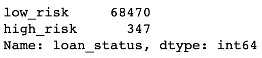

The machine learning algorithms used were:
* RandomOverSampler
* SMOTE
* ClusterCentroids
* SMOTEENN
* BalancedRandomForestClassifier
* EasyEnsembleClassifier

The models were run and then evaluated for performance and accuracy at predicting credit risk.

## Results
In examining the results we will look at the Balanced Accuracy Score as well as the Imbalanced Classification Report (ICR) from each model. Of particular interest in the ICR are two figures from the "f1" (F-score) column - the number from the bottom "avg / total" row, as well as the f-score from the "high risk" row, since we're primarily interested in our ability to detect high credit risk individuals. 

The following results are presented in ascending levels of performance, based on their Balanced Accuracy Scores, starting with the worst-performing model and moving to the best.

* **Cluster Centroids Undersampling** gave us the worst results, with an accuracy score of 0.5295. That means that it did little better than 50%, or a 50/50 coin-toss, at accurately predicting credit risks.
    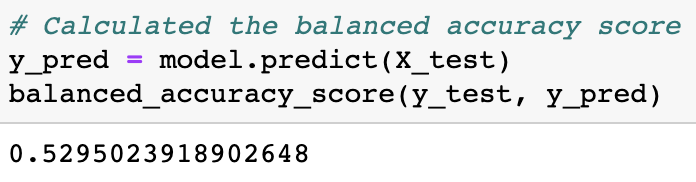

    It's F-scores were similarly disappointing, achieving an average of only 0.56 and an F-score for high-risk prediction of only 0.01.
    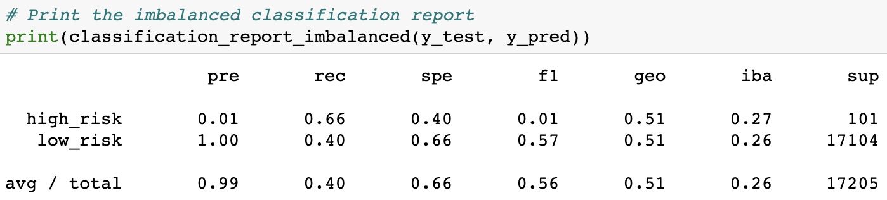

* **Combination Sampling** gave us the second-worst results, with an accuracy score of 0.6529. That means that it did little better than 65%, or 2/3rds accuracy at predicting credit risks.
    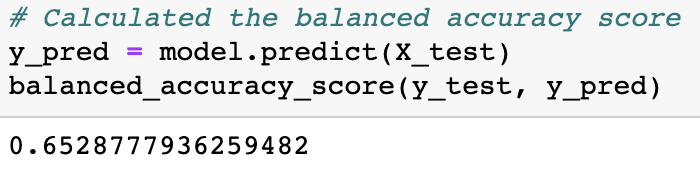

    It's F-scores were still disappointing, achieving an average of only 0.72 and an F-score for high-risk prediction of only 0.02.
    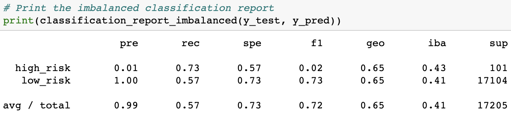

* **SMOTE Oversampling** gave us the third-worst results, with an accuracy score of 0.662. This is about the same performance we saw from **Combination Sampling**. This means that it did little better than 66%, or 2/3rds accuracy at predicting credit risks.
    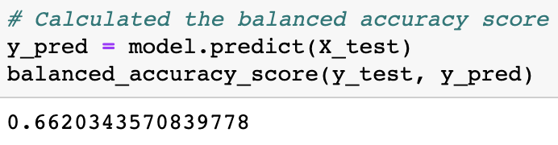

    It's F-scores showed were also disappointing, achieving only a marginally improved average of 0.80 and another F-score for high-risk prediction of only 0.02.
    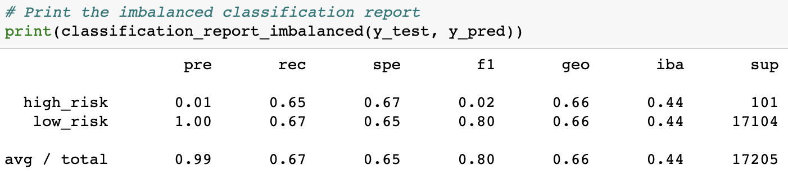

* **Naive Random Oversampling** brings us to the midway point in our model performances. The ROS model gave us the third-best results, with an accuracy score of 0.6732. This is still about the same performance we saw from **Combination Sampling** and **SMOTE Oversampling**. This means that it did little better than 67%, or 2/3rds accuracy at predicting credit risks.
    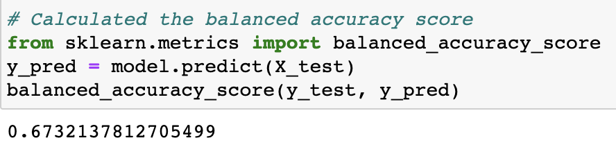

    It's F-scores were also worse or on-par with **SMOTE Oversampling**. The ROS model achieved an average of 0.76 and another F-score for high-risk prediction of only 0.02.
    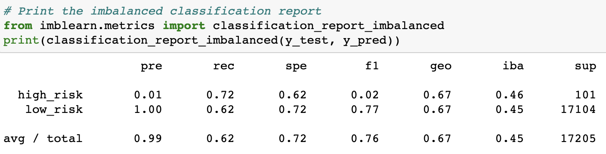

* **Balanced Random Forest Classifier** gave us the second-best results, showing marked improvement with an accuracy score of 0.7615. However, this is still far from perfect. This means that it could only accurately predict about 76%, or 3/4ths of the appropriate levels of credit risks.
    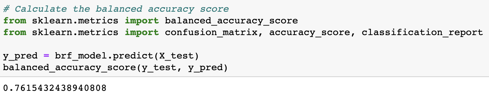

    It's F-scores were where there was most improvement (relatively). The BRFC model achieved an average F-score of 0.92, which is at least in the 90's. However, it's F-score for high-risk prediction was still low, at only 0.06.    
    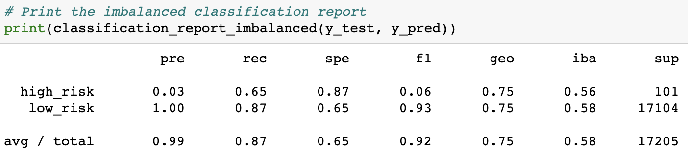

* **Easy Ensemble AdaBoost Classifier** was the best-performing model, hands-down. It's results were leagues beyond all other models attempted. It gave us an accuracy score of 0.9319. While not perfect, this means that it could accurately predict at a rate greater than 93% of the appropriate levels of credit risks.
    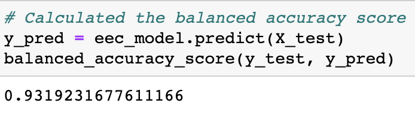

    It's F-scores were also fairly impressive. The EEC model achieved an average F-score of 0.97. However, while the best performing, it's F-score for high-risk prediction was still low, at only 0.16.      
    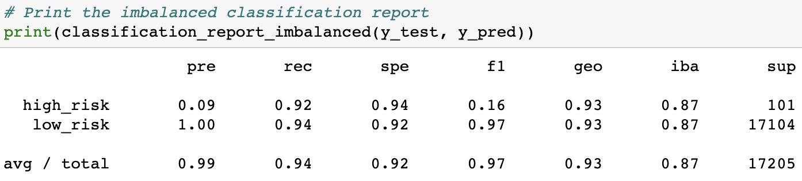

## Summary
In conclusion, credit-risk is a difficult thing to predict, even for advanced machine learning algorithms with 93 columns of data to process. While the **Easy Ensemble AdaBoost Classifier** model had the highest overall accuracy, this was largely due to the fact that the dataset was so radically unbalanced. Even when it's balanced accuracy and average F-score were above 90%, it's F-score for high-risk prediction was no better than 0.16. In the end, I would advise against using any of these algorithms, as it would put creditors as too great of risk being unable to accurately predict who the high-risk clients/debtors would be.